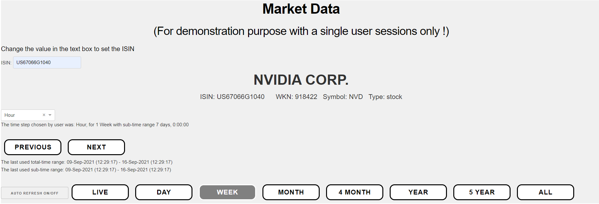
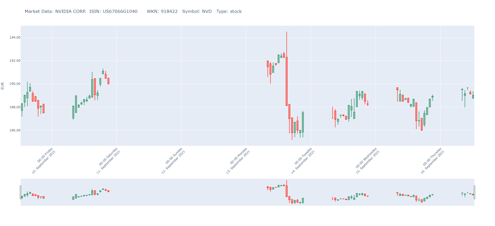
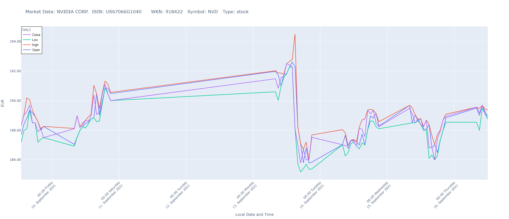

# lm-usage
 Tools:

## plot_candlestick_chart.py

#### Shows the candlestick diagram of a stock for one month.

## plot_candlestick_Interactive.py

#### Shows the candlestick diagram of a stock for one week with hourly values.
#### In the below image the left and right makers can be moved to zoom.

## plot_candlestick_w_dash.py

#### Shows the candlestick and OHLC diagram of a stock.
#### The time frame can be chosen: Day, Week, Month, 4 Months, Year, 5 Years and all
#### The time step can be chosen: Day, Hour, Minute
#### In Addition a Live Modus is available (the Button Auto Refresh On/Off has to be pressed also)

