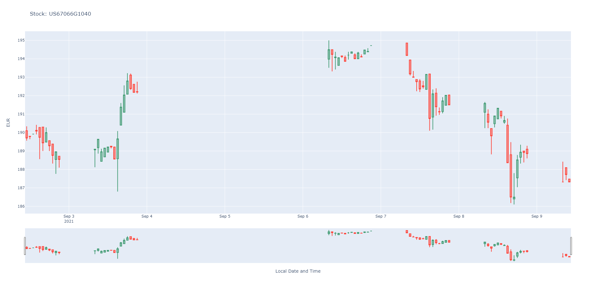

# lm-usage
 Tools:

## plot_candlestick_chart.py

#### Shows the candlestick diagram of a stock for one month.

## plot_candlestick_Interactive.py

#### Shows the candlestick diagram of a stock for one week with hourly values.
#### In the below image the left and right makers can be moved to zoom.
